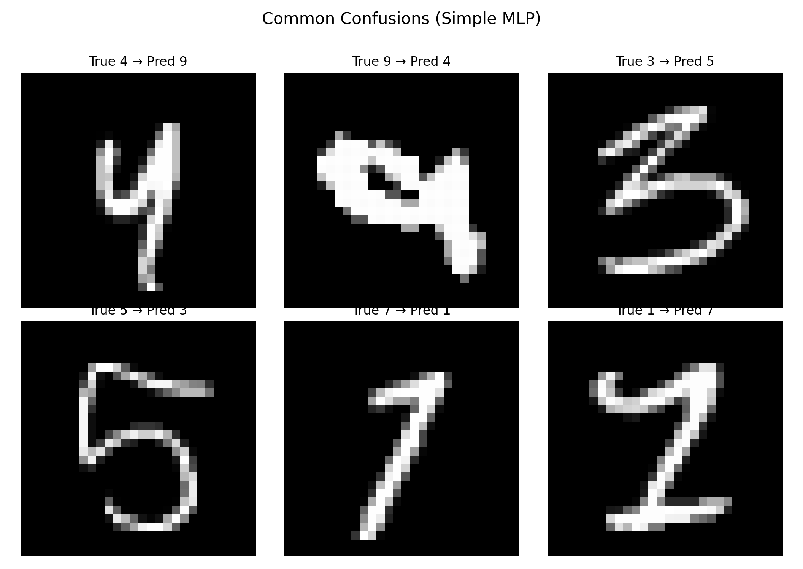

# Building a Multi-Layered Perceptron to production-ready digit classifier

**Goal:** Build a MLP to be able to predict hand drawn digits from 0-9
**input data:** MNIST 28*28 pixel images of handwritten digits 0-9 (60k train / 10k test grayscale digits).

## Demo: 
[Try it for yourself:](https://huggingface.co/spaces/Eli181927/elliot_digit_classifier)


Or watch demo video:
<p align="center">
  <a href="https://www.youtube.com/watch?v=RzZ32FRI4nI">
    
  </a>
</p>

## My demo walkthough why it works


## [Read training file to learn how to implement](/1.MLP/training.py)

## My process

### 1st iteration: Simple Multi Layer Perceptron
- Architecture: 784 → 10 (single linear layer) with softmax, trained via full-batch gradient descent.
- Result: **92.6% dev accuracy**, **91–92% test accuracy**.
- Takeaway: even a naive implementation works, but capacity and optimization limit headroom.


### Results after 1st iteration: 
- 92% on both train and dev set with loss stuck on 0.28. The capacity was too low. 
- Common errors on similar shapes (4vs9, 3vs5 and 7vs1) and a low confidence score demonstrated the classifier wasn't being precise enough with patterns and couldn't combine patterns for a more accurate prediction.
- Loss curve wobbled even late in training, demonstrating late loss curve uncertainty

<table>
<tr>
<td width="50%">
  
  <p align="center"><strong>Loss Plateau</strong>
  <br>Train vs dev loss with the late-epoch plateau highlighted.
  </p>
</td>
<td width="50%">
  
  <p align="center"><strong>Loss Wobble</strong>
  <br>Zoomed view of the oscillating loss after the plateau.
  </p>
</td>
</tr>
</table>

<p align="center">
  
  <br><strong>Common Confusions</strong>
  <br>Grid of classic mistakes (4→9, 3→5, 7→1, etc.).

### 2nd Iteration: Architecture and Training Improvements 
- Architecture upgrade: 784 → 256 → 128 → 10 with ReLU activations.
- Training changes: mini-batch Adam (batch 128), He initialization, L2 regularization (5e-4), 15 epochs.
- Metrics: **99.8% train accuracy**, **97.1% dev accuracy**, **97.2% test accuracy**.
- Insight: depth + adaptive optimization + regularization bridge the gap to state-of-the-art MNIST results.

### Putting into Production 
- Interactive app (`python app.py`): Putting into production. Accuracy was very low from the start. 
- Added diagnostic: shows exact 28x28 tensor fed into the NN, stroke density (sum of pixel value), center offset and area ratio. Found that the production input was too different from the training data. 
- Passed heavy stress testing as shown in the video

### Quick Start
```bash
python training.py     # retrain and persist weights/norm stats
python test_model.py   # validate on the 10k MNIST test set
python app.py          # launch the sketchpad digit inspector
```

Everything—from data ingestion to UI—runs in this repo with pure NumPy. No high-level ML frameworks, yet the model still delivers **97%+** accuracy and production-grade UX.
