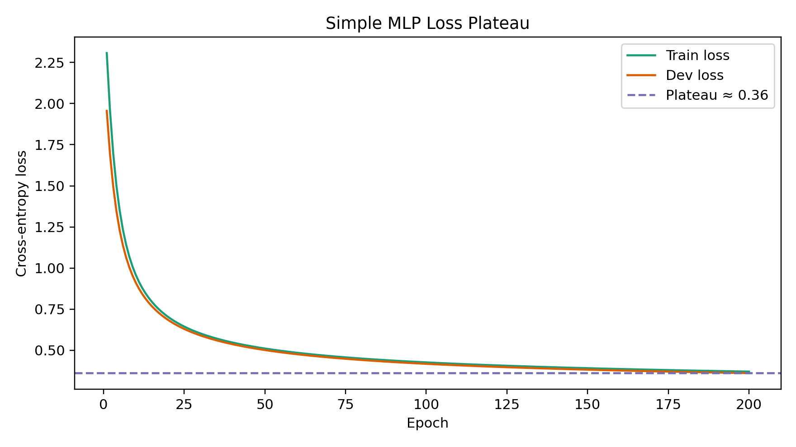
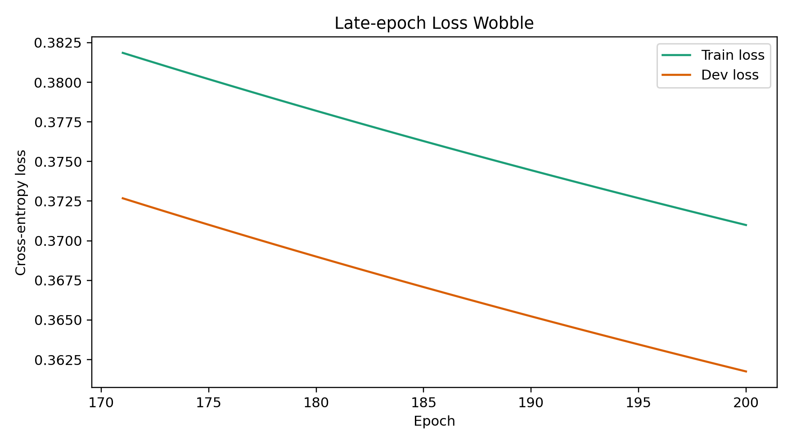
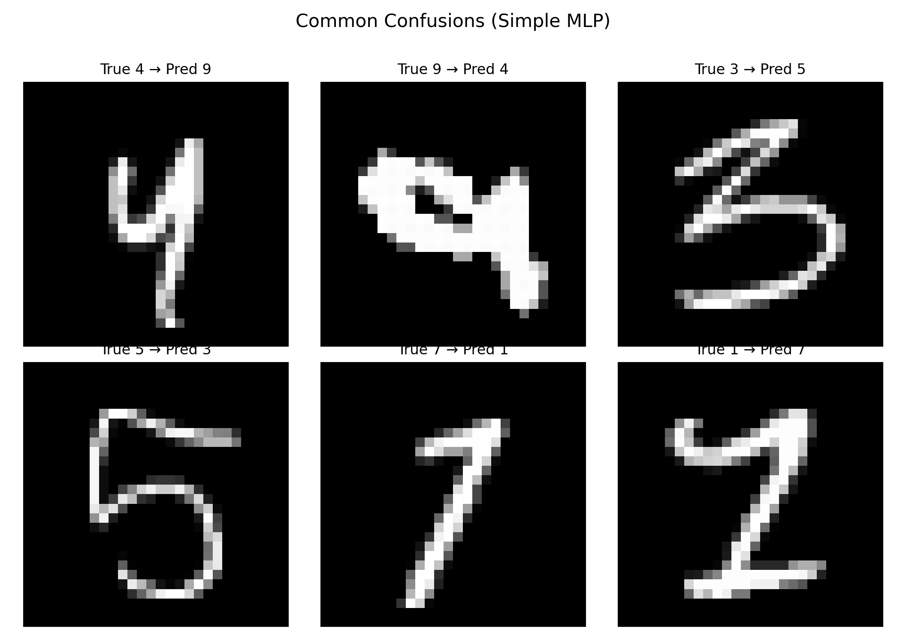

# 1. Multi-Layer Perceptron — MNIST Digit Classifier

<p align="center">
  
  
</p>

[Try the live demo](https://huggingface.co/spaces/Eli181927/elliot_digit_classifier/) · [Training code](training.py)

---

## Goal

Build an MLP from scratch (pure NumPy, no ML frameworks) to predict hand-drawn digits 0-9 and deploy it to production.

| | |
|---|---|
| **Dataset** | MNIST 28×28 grayscale images (60k train / 10k test) |
| **Architecture** | 784 → 256 → 128 → 10 with ReLU, Adam, He init, L2 regularization |
| **Result** | **97%+ test accuracy** |

<p align="center">
  <a href="https://www.youtube.com/watch?v=RzZ32FRI4nI">
    
  </a>
  <br><em>Demo walkthrough video</em>
</p>

---

## Process

### Iteration 1: Simple Single-Layer MLP

- **Architecture**: 784 → 10 (single linear layer) with softmax, full-batch gradient descent
- **Result**: 92.6% dev accuracy, 91-92% test accuracy
- **Issues**: capacity too low, loss plateau at 0.28, confusions on similar shapes (4/9, 3/5, 7/1)

<table>
<tr>
<td width="50%">
  
  <p align="center"><strong>Loss Plateau</strong><br>Train vs dev loss with late-epoch plateau.</p>
</td>
<td width="50%">
  
  <p align="center"><strong>Loss Wobble</strong><br>Zoomed view of oscillating loss after the plateau.</p>
</td>
</tr>
</table>

<p align="center">
  
  <br><strong>Common Confusions</strong> — Classic mistakes (4→9, 3→5, 7→1)
</p>

### Iteration 2: Deeper Architecture + Better Training

- **Architecture**: 784 → 256 → 128 → 10 with ReLU activations
- **Training**: mini-batch Adam (batch 128), He initialization, L2 regularization (5e-4), 15 epochs
- **Result**: 99.8% train, 97.1% dev, **97.2% test accuracy**

### Production Deployment

- Interactive app (`python app.py`) for drawing and classifying digits
- Added diagnostics: shows exact 28×28 tensor fed to the NN, stroke density, center offset, area ratio
- Found production input was too different from training data — adjusted preprocessing
- Passed heavy stress testing (see demo video above)

Everything — from data ingestion to UI — runs with pure NumPy. No high-level ML frameworks, yet the model delivers **97%+** accuracy and production-grade UX.

---

## Quickstart

```bash
cd 1.MLP
python -m venv .venv && source .venv/bin/activate
pip install -r requirements.txt

python setup_data.py            # download MNIST → archive/
python training.py              # train → archive/trained_model.npz
python test_model.py            # evaluate on test set
python app.py                   # launch local demo
```

---

## Files

```
1.MLP/
├── training.py                 # Full MLP training from scratch
├── app.py                      # Gradio demo app
├── test_model.py               # Test set evaluation
├── setup_data.py               # Download & prepare MNIST
├── requirements.txt
└── assets/                     # Training plots and diagrams
```
