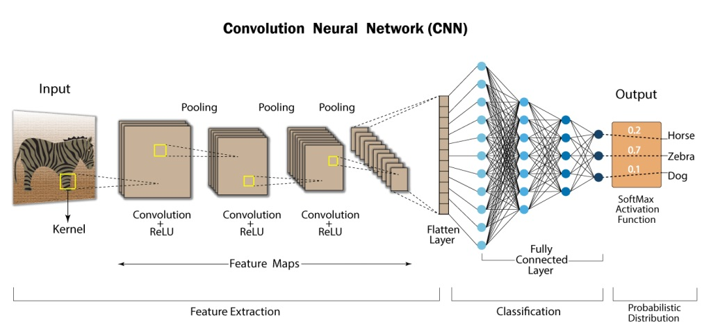
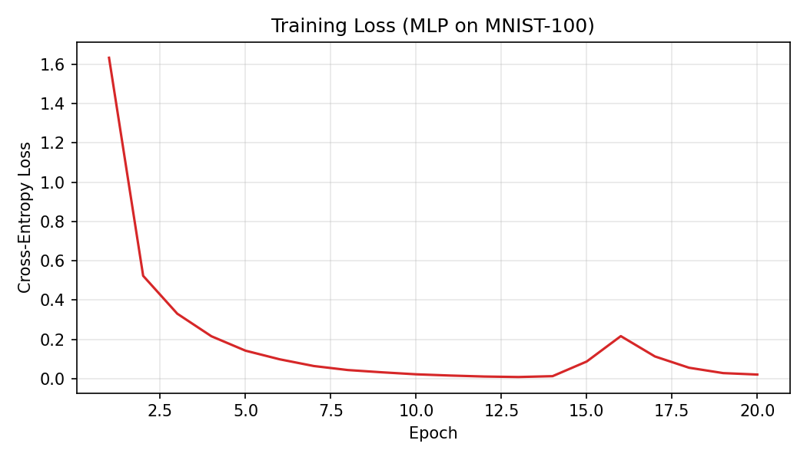
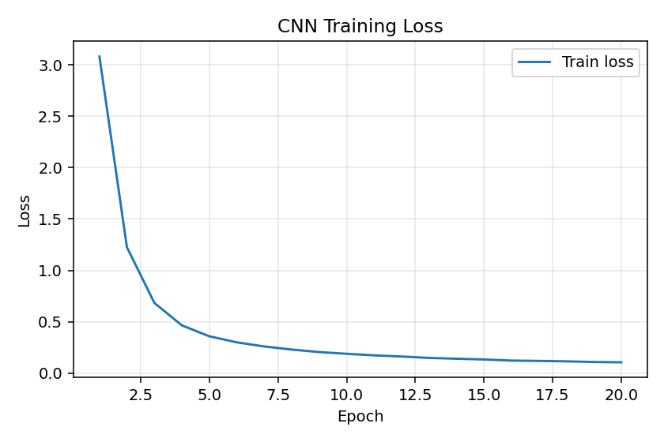

# Convolutional Neural Network -> 0-99 digit classifier

**Goal:** Scale the MLP approach to recognizing two-digit numbers using convolutional neural networks/
**input data:** MNIST-100 28*56 pixel images of handwritten digits 0-99 (60k train / 10k test grayscale digits).

#### [Try out the demo for yourself](https://huggingface.co/spaces/Eli181927/0-99_Classification)


## Convolutional Neural Networks
[Simple explanation of CNN](https://www.youtube.com/watch?v=QzY57FaENXg) [or this one](https://www.youtube.com/watch?v=YRhxdVk_sIs)

CNN's are different than MLP because they have **convolutional layers** desgined recognise spacial patterns in data such as images.




The **convolutional layers** are able to learn to detect patterns (like edges or textures) in an image using small (usually 3x3) kernels (or filters). 

**Kernels** slides across the image, and builds a feature map to recognise where certain visual patterns occur.


After that, **pooling** layers (usually MaxPool) is then used to reduse the spacial dimensions to keep only the strongst signals from these feature maps and throws away the rest. This makes the network more efficient and less sensitive the noise.

Between these layers, **activation functions** (ReLU, GELU etc) help decide whether the pattern actually matters.

After all the spacial information you need has been extracted, the data is then flattened (from 3D feature map into a 1D vecotr) so it can be apssed into a fully connected layer, just like in an MLP.

This is the gist of the Convolutional Neural Networks. These networks are thus able to build increasingly complex representations of the image through deeper layers going from simplw edge recognition to eye or hair recognition in a image.


## My process

### MLP test
I first implemented the MLP from the precious step: 

**Results**
- **High train accuracy, lower dev accuracy**: ~99% train vs ~87% dev indicates overfitting.
- **Loss/accuracy curves**: train kept improving while dev plateaued; the **generalization gap** widened over epochs.
- **Sensitivity to position/strokes**: the MLP treats pixels independently and lacks spatial bias, so small shifts or stroke variations in the two-digit images degraded performance.

<table>
  <tr>
    <td align="center">
      <br/>
      <em>Training loss over epochs</em>
    </td>
    <td align="center">
      <br/>
      <em>Train vs Dev accuracy — note widening gap</em>
    </td>
  </tr>
  
</table>

<p align="center">
  <br/>
  <em>Generalization gap (train − dev), highlighting overfitting</em>
</p>

**Why implementing a CNN:**

- **Local receptive fields**: convolutions learn stroke-level features (edges, corners) that compose into digit parts.
- **Weight sharing**: far fewer parameters than a dense MLP at 28×56 resolution, improving generalization.
- **Translation tolerance**: pooling and convolution make predictions more robust to small shifts and deformations common in handwriting.
- **Two-digit layout**: wider 28×56 inputs benefit from spatial feature extractors that can independently capture left/right digits and their spacing.

### Implementing CNN
- **Data & normalization**: paired MNIST 28×56 grayscale (labels 00–99). Scale to [0,1], then standardize each feature with the training-set mean/std (persisted for test-time use). 
- **Augmentation (lightweight)**: random horizontal shifts up to ±2 px and mild contrast/brightness jitter (σ=0.1) per mini-batch to handle stroke thickness and spacing variance.
- **Architecture**: Conv(3×3,16) → ReLU → MaxPool(2×2) → Conv(3×3,32) → ReLU → MaxPool(2×2) → Flatten → FC(256) → ReLU → Dropout(p=0.4) → FC(100) → Softmax.
- **Optimization**: Adam (lr=1e-3, β1=0.9, β2=0.999, ε=1e-8), He initialization, L2 regularization (λ=1e-4), batch size 256, up to 20 epochs.
- **Early stopping**: patience=5 with min_delta=1e-3 on dev accuracy; keep the best dev checkpoint.
- **From-scratch ops**: NumPy-only conv via sliding-window im2col/col2im, max-pooling, ReLU, dropout on FC, vectorized softmax cross-entropy with L2, and full backward pass.
- **Hparam search/pipeline**: LR sweep and log-uniform random search over (lr, λ); optional auto-train pipeline searches then retrains and saves `archive/trained_model_mnist100.npz` including `mean`/`std` for normalization.
- **Evaluation utility**: `test_model.py` loads saved params and stats to report test accuracy and a simple per-class breakdown.

### Training Options

You can train this model in two ways:

1) From-scratch NumPy implementation (GPU recommended)

```bash
cd 2.CNN
python -m venv .venv && source .venv/bin/activate
pip install -r requirements.txt

# Prepare dataset (writes CSVs to 2.CNN/archive/)
python setup_data.py

# Train from scratch and save NPZ
python training-100.py --epochs 20 --batch-size 256
```

2) Library-based PyTorch implementation (fast on CPU)

```bash
cd 2.CNN
python -m venv .venv && source .venv/bin/activate
pip install -r requirements.txt

# Prepare dataset (writes CSVs to 2.CNN/archive/)
python setup_data.py

# Train with PyTorch and save checkpoint
python training_torch.py --epochs 20 --batch-size 256 --device cpu

# If you have a GPU, you can also use:
# python training_torch.py --device cuda
```

Notes:
- Both paths standardize inputs with the training-set mean/std to ensure identical preprocessing.
- The PyTorch path saves `archive/trained_model_mnist100_torch.pt` with the model `state_dict`, `mean`, and `std`.
- The from-scratch path saves `archive/trained_model_mnist100.npz` with raw parameters and normalization stats.

### CNN Results
20-epoch run (full dataset), batch size 1024. Final epoch: ~96.6% train accuracy, ~94.7% dev accuracy. Curves below.

**Test accuracy:** 97.88% (10000 samples)

Hardest classes (lowest accuracy):
- 29: 90.20% (92/102)
- 97: 93.40% (99/106)
- 39: 93.75% (90/96)
- 33: 94.06% (95/101)
- 70: 94.12% (96/102)


<table>
  <tr>
    <td align="center">
      <br/>
      <em>CNN training loss</em>
    </td>
    <td align="center">
      <br/>
      <em>Train vs Dev accuracy </em>
    </td>
  </tr>
</table>

<p align="center">
  <br/>
  <em>Generalization gap (train − dev)</em>
</p>
