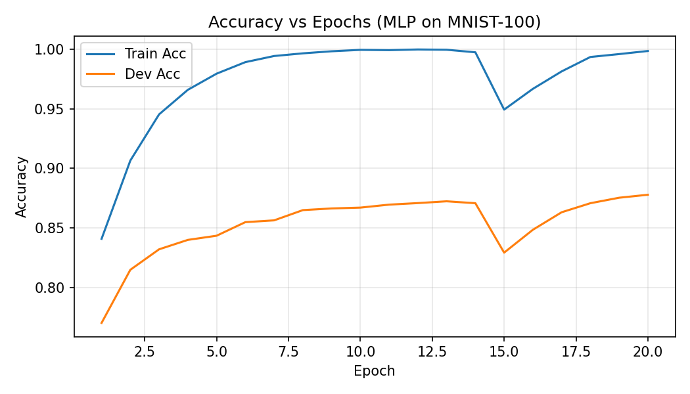

# Convolutional Neural Network -> 0-99 digit classifier

[Simple explanation of CNN](https://www.youtube.com/watch?v=QzY57FaENXg)

**Goal**: Scale the MLP approach to recognizing two-digit numbers.
**input data:** MNIST-100 28*56 pixel images of handwritten digits 0-99 (60k train / 10k test grayscale digits).

## Demo: 
[Try it out for yourself]()

### 1st itreation
Wanted to try to implement the MLP with this new data but with some changes to handle the new input data. I got 99% on train and 87% on dev.

<table>
  <tr>
    <td align="center">
       
      <em>Training loss over epochs</em>
    </td>
    <td align="center">
       
      <em>Train vs Dev accuracy — note widening gap</em>
    </td>
  </tr>
  
</table>

   
  <em>Generalization gap (train − dev), highlighting overfitting</em>

#### What we observed after the 1st iteration (MLP)
- **High train accuracy, lower dev accuracy**: ~99% train vs ~87% dev indicates overfitting.
- **Loss/accuracy curves**: train kept improving while dev plateaued; the **generalization gap** widened over epochs.
- **Sensitivity to position/strokes**: the MLP treats pixels independently and lacks spatial bias, so small shifts or stroke variations in the two-digit images degraded performance.

#### Why we moved to a CNN
- **Local receptive fields**: convolutions learn stroke-level features (edges, corners) that compose into digit parts.
- **Weight sharing**: far fewer parameters than a dense MLP at 28×56 resolution, improving generalization.
- **Translation tolerance**: pooling and convolution make predictions more robust to small shifts and deformations common in handwriting.
- **Two-digit layout**: wider 28×56 inputs benefit from spatial feature extractors that can independently capture left/right digits and their spacing.

