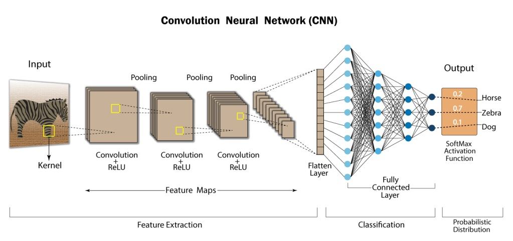
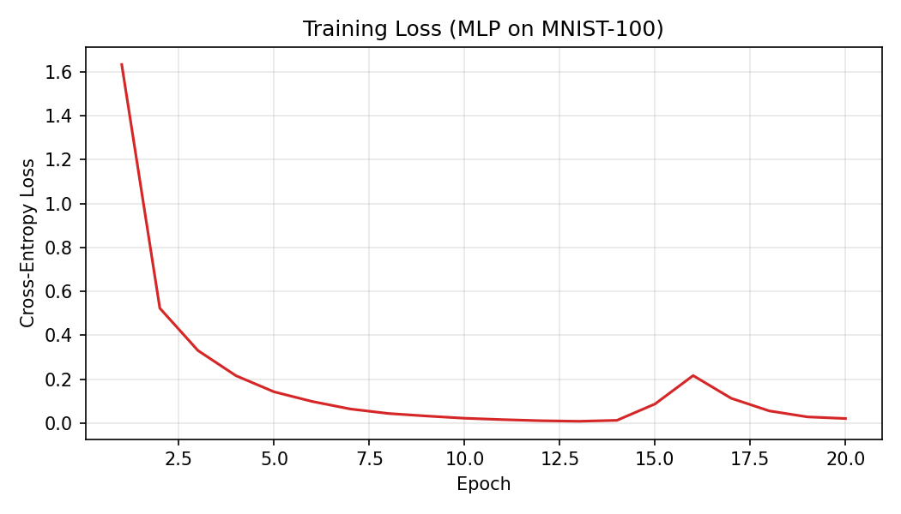
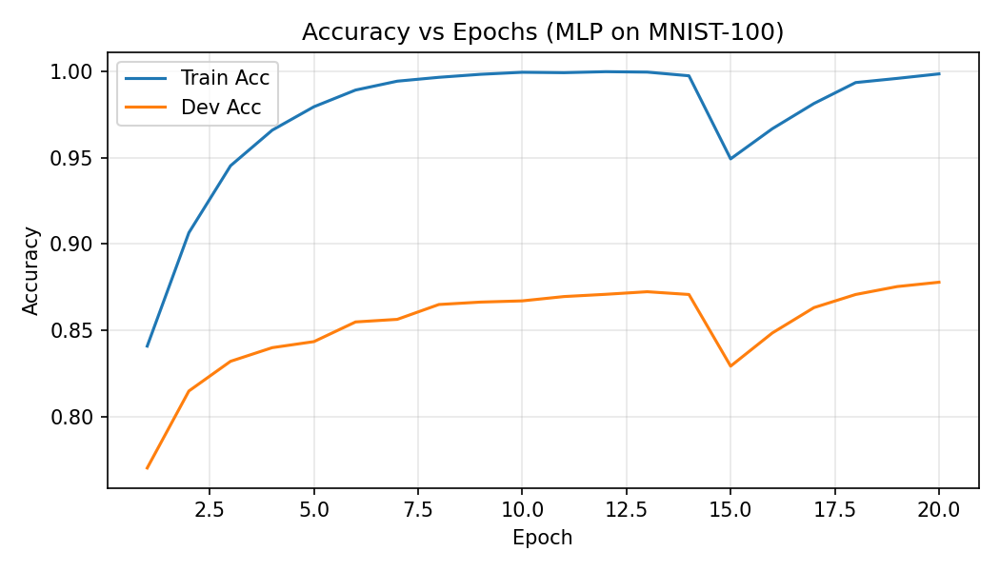
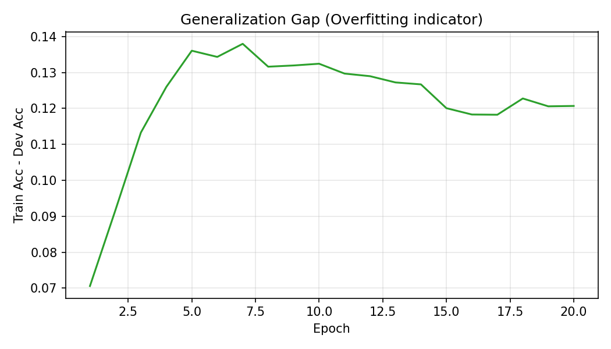
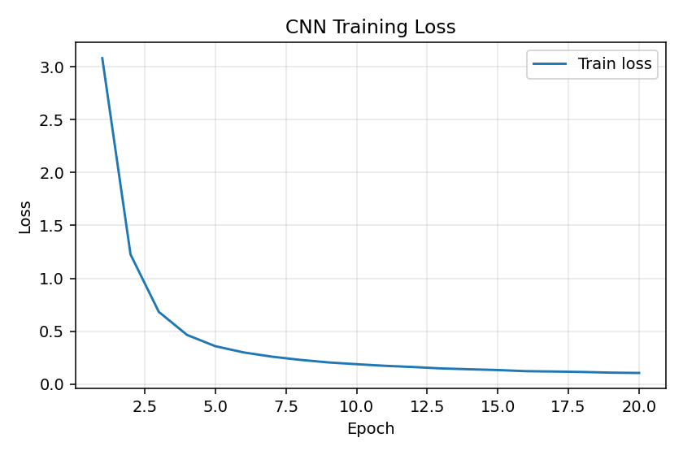
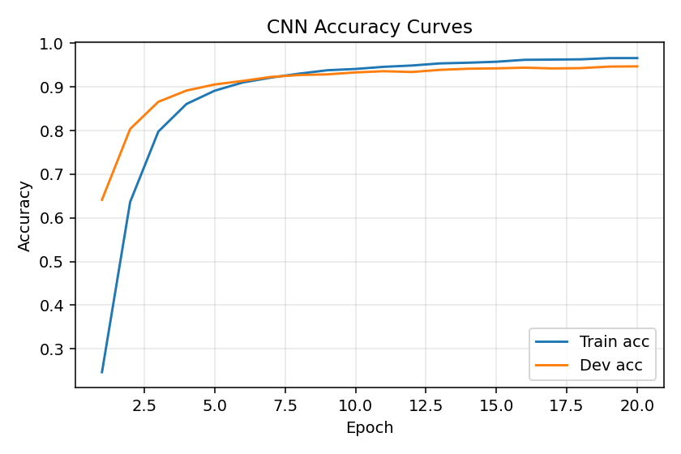
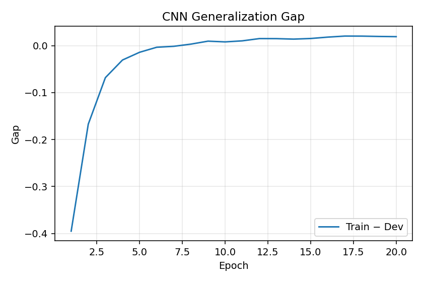

# 2. Convolutional Neural Network — 0-99 Digit Classifier

<p align="center">
  
  
  
</p>

[Try the live demo](https://huggingface.co/spaces/Eli181927/0-99_Classification) · [Training code (PyTorch)](training_torch.py) · [Training code (from scratch)](training-100.py)

---

## Goal

Scale the MLP approach to recognizing two-digit numbers using convolutional neural networks.

| | |
|---|---|
| **Dataset** | MNIST-100: 28×56 images of handwritten digits 0-99 (concatenated pairs) |
| **Architecture** | Conv(3×3,16) → ReLU → MaxPool → Conv(3×3,32) → ReLU → MaxPool → FC(256) → Dropout(0.4) → FC(100) |
| **Result** | **97.88% test accuracy** (10,000 samples) |

---

## Why CNNs?

CNNs are different from MLPs because they have **convolutional layers** designed to recognize spatial patterns in images.



**Kernels** (small 3×3 filters) slide across the image, building a feature map that shows where certain visual patterns occur.


**Pooling** layers (usually MaxPool) reduce spatial dimensions, keeping only the strongest signals. **Activation functions** (ReLU, GELU) determine which patterns actually matter. After spatial feature extraction, the data is flattened and passed into fully connected layers — just like an MLP.

Through deeper layers, CNNs build increasingly complex representations: from simple edges to high-level features.

---

## Process

### MLP Baseline

First tested the MLP from the previous section:
- ~99% train vs ~87% dev — clear overfitting
- The MLP treats pixels independently and lacks spatial bias, so small shifts degraded performance

<table>
  <tr>
    <td align="center">
      <br/>
      <em>Training loss over epochs</em>
    </td>
    <td align="center">
      <br/>
      <em>Train vs Dev accuracy — widening gap</em>
    </td>
  </tr>
</table>

<p align="center">
  <br/>
  <em>Generalization gap (train − dev)</em>
</p>

### CNN Implementation

- **Data & normalization**: scale to [0,1], standardize with training-set mean/std
- **Augmentation**: random horizontal shifts (±2 px), mild contrast/brightness jitter
- **Optimization**: Adam (lr=1e-3), He init, L2 regularization (λ=1e-4), batch size 256, up to 20 epochs
- **Early stopping**: patience=5, min_delta=1e-3 on dev accuracy
- **From-scratch ops**: NumPy-only conv via im2col/col2im, max-pooling, dropout, vectorized softmax cross-entropy, full backward pass

### CNN Results

**Test accuracy: 97.88%** (10,000 samples)

Hardest classes: 29 (90.2%), 97 (93.4%), 39 (93.8%), 33 (94.1%), 70 (94.1%)

<table>
  <tr>
    <td align="center">
      <br/>
      <em>CNN training loss</em>
    </td>
    <td align="center">
      <br/>
      <em>Train vs Dev accuracy</em>
    </td>
  </tr>
</table>

<p align="center">
  <br/>
  <em>Generalization gap (train − dev)</em>
</p>

---

## Quickstart

Two training options:

**Option A: From-scratch NumPy (GPU recommended)**

```bash
cd 2.CNN
python -m venv .venv && source .venv/bin/activate
pip install -r requirements.txt
python setup_data.py
python training-100.py --epochs 20 --batch-size 256
```

**Option B: PyTorch (fast on CPU)**

```bash
cd 2.CNN
python -m venv .venv && source .venv/bin/activate
pip install -r requirements.txt
python setup_data.py
python training_torch.py --epochs 20 --batch-size 256 --device cpu
```

Then evaluate and run the demo:

```bash
python test_model.py
python app.py
```

---

## Files

```
2.CNN/
├── training-100.py             # From-scratch NumPy CNN
├── training_torch.py           # PyTorch CNN implementation
├── app.py                      # Gradio demo app
├── test_model.py               # Test set evaluation
├── setup_data.py               # Download & prepare MNIST-100
├── requirements.txt
└── assets/                     # Training plots and diagrams
```
