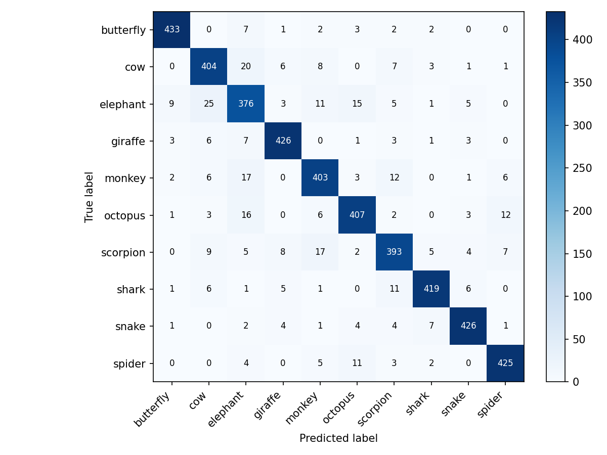
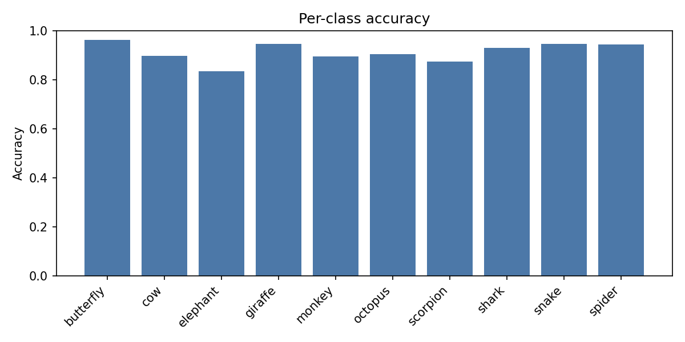
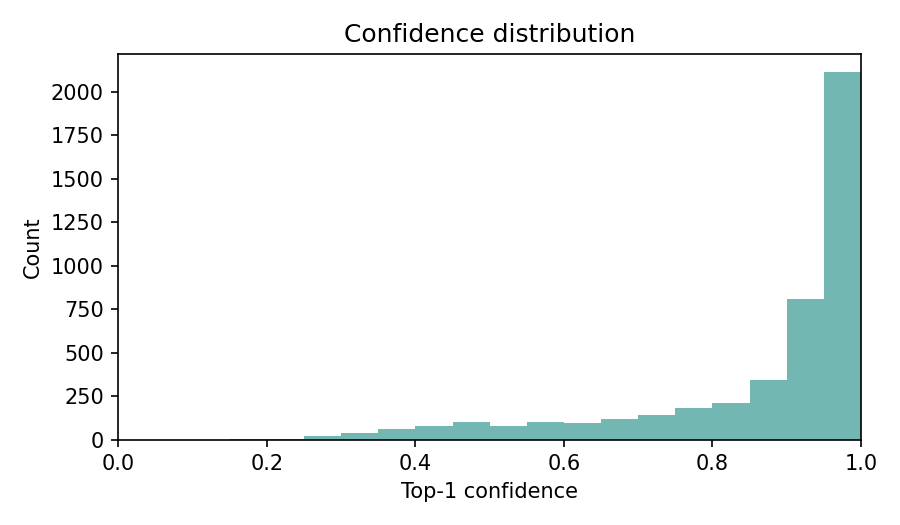

# Doodle classification with RNN
**Goal:** Use a Recurrent Neural Network to accurately classify doodles.
**Input data:** Quick Draw doodles.

#### [Try out the demo for yourself](https://huggingface.co/spaces/Eli181927/animal_doodle_classifier)

## Recurrent Neural Networks
[Simple to follow explanation of RNN](https://www.youtube.com/watch?v=AsNTP8Kwu80) 

A **Recurrent Neural Network** is a neural network trained on sequential data (like text, time series, or speech) to make sequence-based predictions.

They are able to do this by maintaining a **hidden state** which acts like memory of past inputs. After each new input, the RNN updates its hidden state based on both the current input and the previous hidden state, allowing it to retain information over time.

At each step, the weights $W_x$ and $W_h$ are applied to the current input $x_t$ and the previous hidden state $h_{t-1}$, together with the bias $b$, to compute the new hidden state and apply an activation such as $\tanh$.

At each step, the update is:

$$
h_t = \tanh\left(W_x x_t + W_h h_{t-1} + b\right)
$$

However, repeated multiplication by small weights causes gradients to shrink exponentially during training—the **vanishing gradient problem**—which makes the network forget long‑term dependencies.

More advanced architectures such as Long Short-Term Memory (LSTM) and Gated Recurrent Unit (GRU) use gates to control the flow of information—deciding what to keep, forget, or add at each step. This preserves important information over long sequences by creating a more stable gradient flow. 

There are several RNN types depending on the number of inputs and outputs: one-to-one, one-to-many, many-to-one, and many-to-many.

## My process

## Iteration 1: training only on animals
- Data: only 10 animals
- Encoding: [dx, dy, pen_lift]; captures motion and stroke boundaries.
- Length rules: drop <6 steps, cap 250; stable, faster training.
- Collation: pad with lengths; pack sequences so GRU ignores padding.
- Model: 2-layer bidirectional GRU (hidden 192); accuracy-speed balance.
- Optimization: AdamW, label smoothing, dropout, grad clipping; robustness.
- Scheduling: ReduceLROnPlateau + early stopping; efficient convergence.
- System: Apple MPS acceleration; save best/last checkpoints for deployment.

## Results & Plots
Test accuracy: 0.9788
Dev accuracy: 0.9945

Epoch 15 | train_loss=0.3095 train_acc1=1.000 val_loss=0.3140 val_acc1=0.909 val_acc3=0.983 | 114.9s

