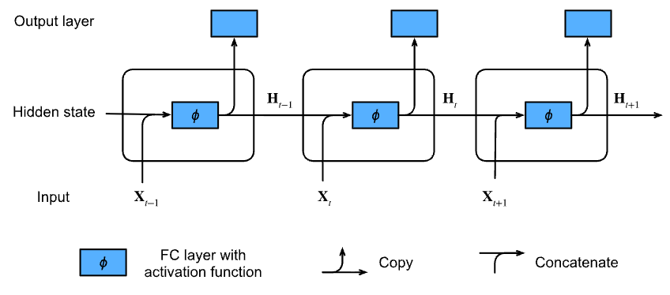
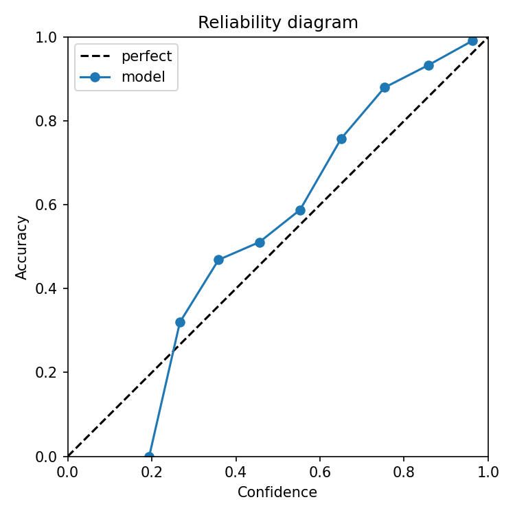

# Doodle classification with RNN
**Goal:** Use a Recurrent Neural Network to accurately classify doodles.
**Input data:** Quick Draw doodles.

#### [Try out the demo for yourself](https://huggingface.co/spaces/Eli181927/animal_doodle_classifier)

## Recurrent Neural Networks
[Simple to follow explanation of RNN](https://www.youtube.com/watch?v=AsNTP8Kwu80) 

A **Recurrent Neural Network** is a neural network trained on sequential data (like text, time series, or speech) to make predictions that depend on previous inputs.

They are able to do this by maintaining a **hidden state** which acts like a memory about what the network has seen so far.

At each time step, the RNN takes 2 things: 
- The current input $x_t$
- The previous hidden state $h_{t-1}$

it then updates the hidden state: 

$$
h_t = \tanh(W_x x_t + W_h h_{t-1} + b)
$$

*Reminder: W are weights, b is a bias terms and tahn is the activation function*

However, during training, repeated multiplications by small weights causes gradients to shrink exponentially (called the **vanishing gradient problem**), which makes the network forget long‑term dependencies.

More advanced architectures such as **Long Short-Term Memory (LSTM)** and **Gated Recurrent Unit (GRU)**, use gates to control the flow of information, deciding what to keep, forget, or add at each step.

LSTM -> 3 gates: forget (discard info), input (new info) and output (send next layer)

GRU -> update gate (forget+input) and reset gate (past info to mix in)

This preserves important information over long sequences by creating a more stable gradient flow. 

There are several RNN types depending on the number of inputs and outputs: one-to-one, one-to-many, many-to-one, and many-to-many.

[Simple cheat-sheet if you need a refresher](https://stanford.edu/~shervine/teaching/cs-230/cheatsheet-recurrent-neural-networks)

## My process

## Iteration 1: training only on animals
- Data: only 10 animals
- Encoding: [dx, dy, pen_lift]; captures motion and stroke boundaries.
- Length rules: drop <6 steps, cap 250; stable, faster training.
- Collation: pad with lengths; pack sequences so GRU ignores padding.
- Model: 2-layer bidirectional GRU (hidden 192); accuracy-speed balance.
- Optimization: AdamW, label smoothing, dropout, grad clipping; robustness.
- Scheduling: ReduceLROnPlateau + early stopping; efficient convergence.
- System: Apple MPS acceleration; save best/last checkpoints for deployment.

## Results & Plots

Test samples: 188 779
Top-1 accuracy: 94.36%
Top-3 accuracy: 99.10%

Epoch 15 | train_loss=0.3095 train_acc1=1.000 val_loss=0.3140 val_acc1=0.909 val_acc3=0.983 | 114.9s

