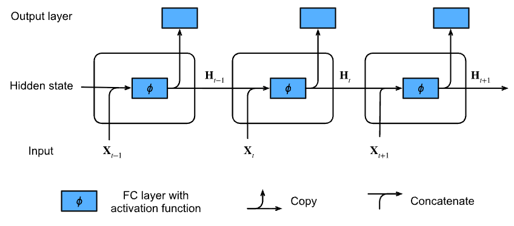
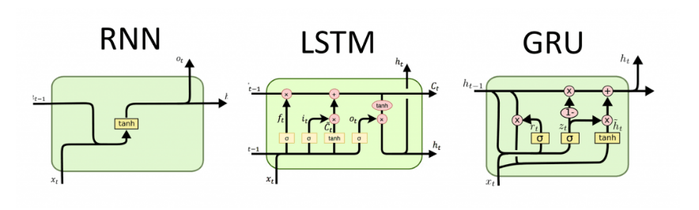
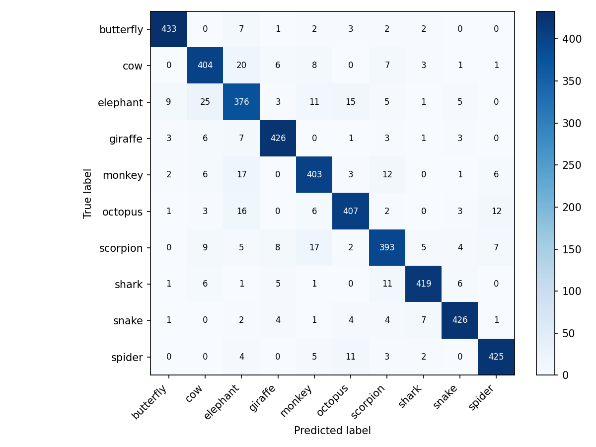
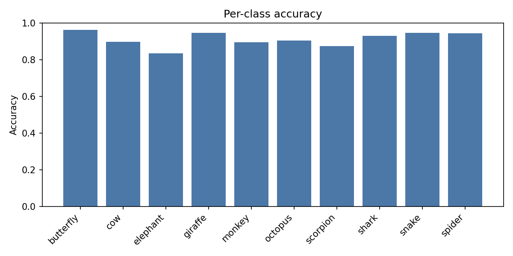
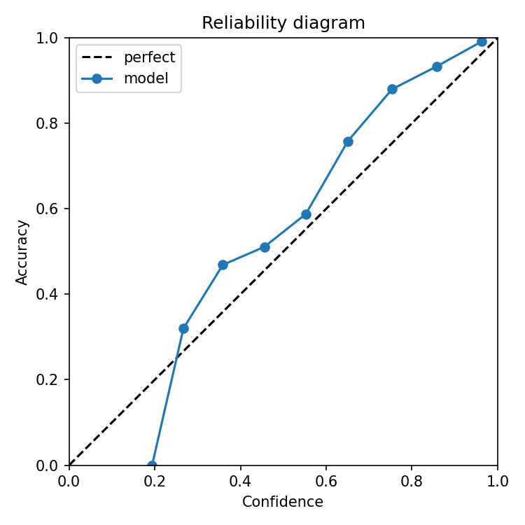
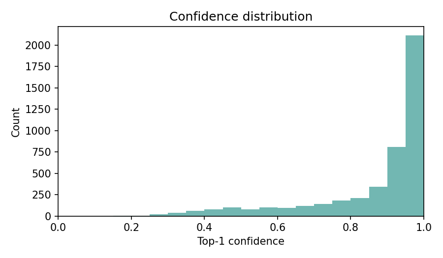

# 3. Recurrent Neural Network — Doodle Classifier

<p align="center">
  
  
</p>

[Try the live demo](https://huggingface.co/spaces/Eli181927/Classification-doodle-RNN) · [Training code](training-doodle.py)

---

## Goal

Use a Recurrent Neural Network to classify hand-drawn doodles into 10 animal classes.

| | |
|---|---|
| **Dataset** | Google Quick, Draw! stroke sequences (dx, dy, pen-lift) — 10 animal classes |
| **Architecture** | 2-layer bidirectional GRU (hidden 192), AdamW, label smoothing, dropout, gradient clipping |
| **Result** | **94.36% top-1 accuracy**, 99.10% top-3 accuracy (188,779 test samples) |

### Weights

Model weights are not tracked in this repo. To run the demo locally:
- **Train** your own checkpoint with `training-doodle.py` (saves to `archive/`), or
- **Download** from the [Hugging Face Space](https://huggingface.co/spaces/Eli181927/Classification-doodle-RNN) and place under `archive/`

---

## Recurrent Neural Networks

[Simple explanation of RNNs](https://www.youtube.com/watch?v=AsNTP8Kwu80)


An **RNN** is a neural network trained on sequential data (text, time series, strokes) that maintains a **hidden state** — a memory of what the network has seen so far.



At each time step, the RNN takes the current input $x_t$ and previous hidden state $h_{t-1}$, and updates:

$$
h_t = \tanh(W_x x_t + W_h h_{t-1} + b)
$$

However, repeated multiplications by small weights cause gradients to shrink exponentially (**vanishing gradient problem**), making the network forget long-term dependencies.

### LSTM & GRU

More advanced architectures use gates to control information flow:

- **LSTM** — 3 gates: forget (discard), input (new info), output (send to next layer)
- **GRU** — 2 gates: update (forget+input combined), reset (past info to mix in)



These preserve important information over long sequences with more stable gradient flow.

[Stanford RNN cheat-sheet](https://stanford.edu/~shervine/teaching/cs-230/cheatsheet-recurrent-neural-networks)

---

## Process

### Training Setup

- **Data**: 10 animal classes from Quick, Draw!
- **Encoding**: [dx, dy, pen_lift] — captures motion and stroke boundaries
- **Length rules**: drop sequences <6 steps, cap at 250
- **Collation**: pad with lengths, pack sequences so GRU ignores padding
- **Model**: 2-layer bidirectional GRU (hidden 192)
- **Optimization**: AdamW, label smoothing, dropout, gradient clipping
- **Scheduling**: ReduceLROnPlateau + early stopping
- **Hardware**: Apple MPS acceleration; saves best/last checkpoints

### Results

| Metric | Value |
|---|---|
| Test samples | 188,779 |
| Top-1 accuracy | **94.36%** |
| Top-3 accuracy | **99.10%** |

<table>
<tr>
<td></td>
<td></td>
</tr>
<tr>
<td></td>
<td></td>
</tr>
</table>

---

## Quickstart

```bash
cd 3.RNN
python -m venv .venv && source .venv/bin/activate
pip install -r requirements.txt

python setup_data.py            # download Quick, Draw! data → archive/
python training-doodle.py       # train → archive/rnn_animals_best.pt
python eval_and_plots.py        # evaluate + generate plots
python app.py                   # launch local demo
```

---

## Files

```
3.RNN/
├── training-doodle.py          # Full RNN training with GRU
├── app.py                      # Gradio demo app
├── eval_and_plots.py           # Evaluation and plot generation
├── setup_data.py               # Download & prepare Quick, Draw! data
├── requirements.txt
└── assets/                     # Architecture diagrams and training plots
```
