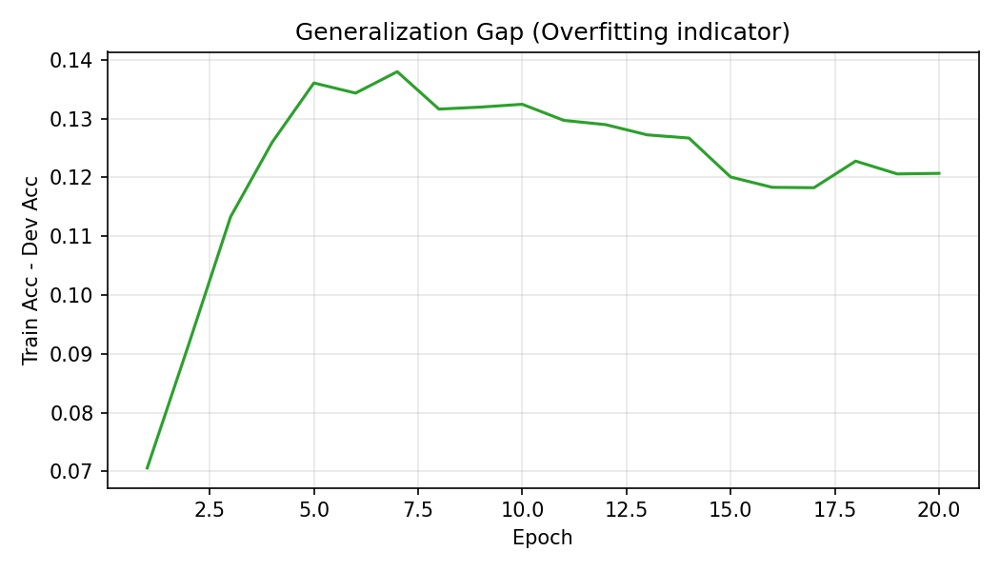

# MNIST-100 Production Pipeline

**Goal**: Scale the MLP approach to recognizing two-digit numbers.
**input data:** MNIST-100 28*56 pixel images of handwritten digits 0-99 (60k train / 10k test grayscale digits).


## Demo: 


### 1st itreation
Wanted to try to implement the MLP with this new data but with some changes to handle the new input data. I got 99% on train and 87% on dev.


<table>
  <tr>
    <td align="center">
      <br/>
      <em>Training loss over epochs</em>
    </td>
    <td align="center">
      <br/>
      <em>Train vs Dev accuracy — note widening gap</em>
    </td>
  </tr>
  
</table>

<p align="center">
  <br/>
  <em>Generalization gap (train − dev), highlighting overfitting</em>
</p>


---

## Quickstart: Train → Evaluate → Launch

```bash
# 1. Auto-tune, train, and save model artefacts for the Gradio app
python training-100.py \
  --mode auto-train \
  --trials 8 \
  --lr-min 1e-4 --lr-max 3e-3 \
  --reg-min 5e-5 --reg-max 5e-4 \
  --epochs 12 \
  --final-epochs 40 \
  --history-dir runs/auto \
  --seed 42

# 2. (Optional) sanity-check on held-out dev set
python test_model.py --model archive/trained_model_mnist100.npz

# 3. Serve the demo
python app.py
```

- `training-100.py` now owns the full pipeline. Auto mode performs a log-uniform random search to find a good `(learning_rate, λ)` pair, then retrains with early stopping and saves the final checkpoint under `archive/trained_model_mnist100.npz`. The Gradio app loads this file on startup.
- Pass `--output-model some/path.npz` if you prefer a different destination.

---

## When You Want Manual Control

**Learning-rate sweep**

```bash
python training-100.py \
  --mode lr-sweep \
  --learning-rates 5e-4,1e-3,2e-3 \
  --epochs 10 \
  --history-dir runs/lr
```

Each run writes epoch-by-epoch metrics to `runs/lr/lr_*.csv`, and the aggregate summary sits in `runs/lr/lr_sweep_summary.csv`.

**Random search without final training**

```bash
python training-100.py \
  --mode random-search \
  --trials 12 \
  --lr-min 5e-5 --lr-max 3e-3 \
  --reg-min 5e-5 --reg-max 5e-4 \
  --epochs 12 \
  --history-dir runs/random \
  --seed 1337
```

Trial histories are stored beneath `runs/random`, and a sorted `random_search_summary.csv` captures the dev accuracy for every configuration.

**Plain training run**

```bash
python training-100.py \
  --mode train \
  --epochs 35 \
  --learning-rate 1e-3 \
  --reg-lambda 1e-4 \
  --history-dir runs/manual \
  --output-model archive/trained_model_mnist100.npz
```

---

## Notes for Production Usage

- The app expects the saved `.npz` bundle to contain `W1`, `b1`, `W2`, `b2`, `W3`, `b3`, and the `mean`/`std` vectors used for normalization. `training-100.py` guarantees this layout.
- Histories exported by the script (CSV) let you track overfitting or LR instability without rerunning experiments.
- Dropout and augmentation targets issues seen in earlier iterations where dev accuracy lagged train accuracy by ~12 points. You can override dropout for both search (`--dropout`) and the final run (`--final-dropout`).
- All randomness is seeded through NumPy. Set `--seed` to reproduce auto-tune searches exactly.
- Gradio preprocessing (`app.py`) mirrors the training normalization and adds several inference-time variants (shifts/dilation/erosion) to stabilise predictions in noisy sketches.
- The UI exposes a “Stroke Intensity” slider so you can match the training distribution without manually tweaking pen colours.

---

## Directory Layout

- `training-100.py` – CLI that covers sweeps, random search, auto-train deployment, and standard training.
- `test_model.py` – Evaluation helpers; accepts `--model` to load the produced `.npz`.
- `app.py` – Gradio UI for drawing two-digit numbers and getting live diagnostics.
- `archive/` – Compressed dataset plus the saved model artefacts.
- `runs/` – Default output root for training histories and sweep summaries.

Replaced the MNIST-100 MLP with a stride‑1 CNN stack and wired every inference entry point to the shared forward pass so the app can benefit from the stronger model.

MNIST-100/training-100.py:28-433 now defines the conv/pool/FC topology, adds vectorised im2col/col2im convolution helpers, and rewrites the forward/backward passes around the two conv blocks (with dropout on the FC layer) plus Adam updates for the new weights.
MNIST-100/training-100.py:517-1016 adjusts the training loop/CLI to accept a single dropout rate, saves the new parameter tensors, and keeps the sweep/auto-train utilities compatible with the CNN artefacts.
MNIST-100/app.py:1-236 loads training-100.py dynamically so the Gradio app reuses the CNN forward pass (no more duplicated dense network), ensuring production predictions match training.
Smoke check: python3 - <<'PY' ... (64-sample forward/backprop on the new network) confirmed gradients and shapes before running a full training session.
Tests: embedded Python smoke run above (forward/backprop on 64 samples).

Next steps:

Train for real: e.g. python3 training-100.py --mode auto-train --trials 8 --lr-min 3e-4 --lr-max 2e-3 --reg-min 5e-5 --reg-max 3e-4 --epochs 12 --final-epochs 45 --history-dir runs/cnn --dropout 0.35 to target >90% dev accuracy.
Verify/ship: python3 test_model.py --model archive/trained_model_mnist100.npz and launch python3 app.py once the CNN checkpoint is in place.

