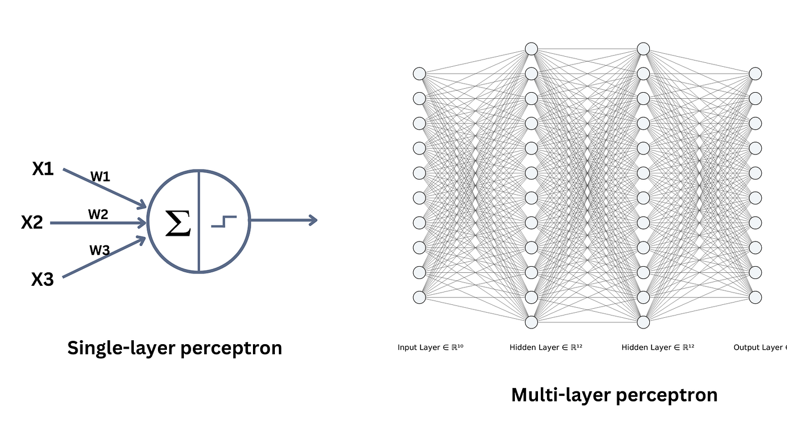
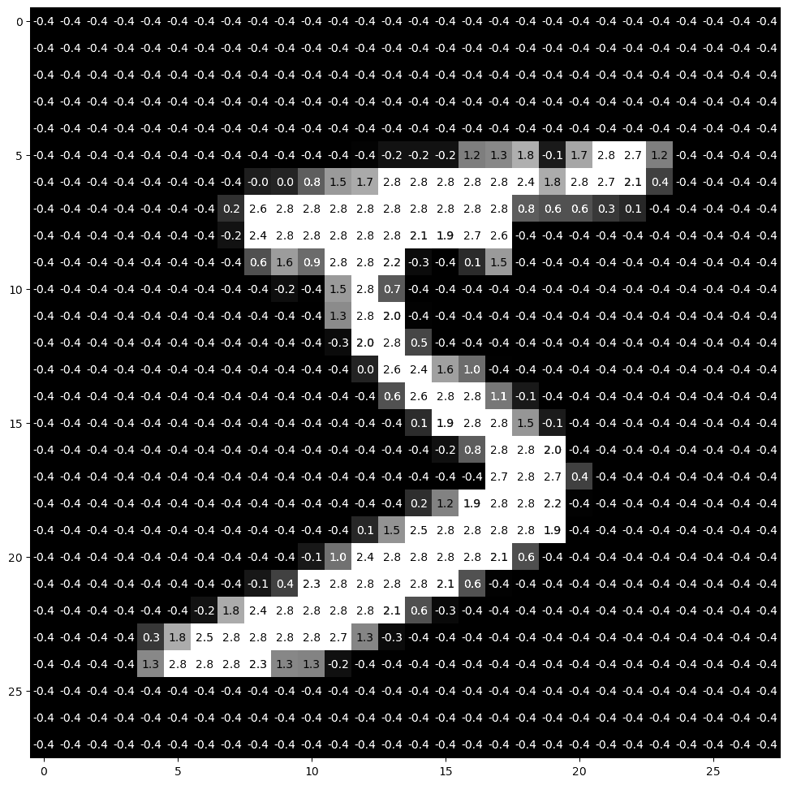

# Multi-Layer Perceptron (MLP), Convolutional Neural Network (CNN), and Recurrent Neural Network (RNN)

## Table of Contents

- [1. Multi-Layer Perceptron](#mlp)
- [2. Convolutional Neural Network](#cnn) 
- [3. Recurrent Neural Network](#rnn)
- [Data](#data)


Neural Networks are the foundation of modern machine learning, thus understanding the main types of architectures like **Multi-Layer Perceptron**, **Convolutional Neural Networks** and **Recurrent Neural Networks** are crucial. 

In this project, I will explore these architectures from scratch, explaining how they work and to implement them in code, allowing for hands-on learning and quick and easy deployment of your model. 


<a id="mlp"></a>
## 1. Multi-Layer Perceptron: MNIST Classification Problem
[Try the MLP digit classifier Demo here](https://huggingface.co/spaces/Eli181927/elliot_digit_classifier/)

|  |  |
|---|---|
| Multi-Layer Perceotron| MNIST Dataset Image|

In this section I will be explaining how to implement a Multi-Layer Perceptron from scratch (no libraries) to solve the MNIST digit classification problem.

For detailed explanation and implementation, see the [MLP README](1.MLP/README.md) and the [training code](1.MLP/training.py). 

#### MNIST Classification Problem
- **Goal** – Accurately predict hand-drawn digits in production. 
- **Dataset** – MNIST 28×28 pixel images (60k train / 10k test grayscale digits).
- **Implementation** – 4-layer ReLU MLP trained with Adam, He initialization, and L2 regularization.
- **Result** – About 97% accuracy on test set 

#### MLP Quickstart

<details>
<summary>Show MLP Quickstart</summary>

Minimal steps to download data, train, test, and run the app.

```bash
# 1) Navigate to project folder and create virtual env
cd 1.MLP
python -m venv .venv && source .venv/bin/activate

# 2) Install deps for the MLP
pip install -r requirements.txt

# 3) Download MNIST and prepare CSVs (writes to archive)
python setup_data.py

# 4) Train (saves model to archive/trained_model.npz)
python training.py

# 5) Evaluate on test set
python test_model.py

# 6) Optional: launch the local demo UI
python app.py
```

</details>

Notes:
- **Data**: 1.MLP/setup_data.py pulls MNIST from a reliable mirror and writes 'mnist_train.csv' and 'mnist_test.csv' under 1.MLP/archive in the exact format expected by training.py and test_model.py.
- **Model file**: Training creates 1.MLP/archive/trained_model.npz, which the demo app loads automatically.


<a id="cnn"></a>
## 2. Convolutional Neural Network: MNIST-100 (0–99 Digits) Classification Problem 
[Try the CNN digit classifier here](https://huggingface.co/spaces/Eli181927/0-99_Classification)

In this section we will be evaluating where the MLP will not be good enough for this dataset and explain how and why implementing a Convolutional Neural Network performs better.

For detailed explanation and implementation see the [CNN README](2.CNN/README.md) and the [training code](2.CNN/training_torch.py).


#### Simple Explanation
- **Goal** – Scale the scratch-built approach to recognizing two-digit numbers.
- **Dataset** – Paired-MNIST where two 28×28 digits are concatenated into 28×56 images for 00–99 labels.
- **Implementation** – Stride-1 CNN with pooling, dropout, Adam, and auto-tuning to streamline training. 

Build from scratch in [training-100.py](2.CNN/training-100.py) for practice but not recommended to train without GPU. Use [training_torch.py](2.CNN/training_torch.py) to run with PyTorch.

- **Result** – Test accuracy 97.88% (on 10,000 samples)

#### CNN Quickstart

<details>
<summary>Show CNN Quickstart</summary>

Minimal steps to download data, train, test, and run the app.

Two options:

1) From-scratch (GPU recommended)

```bash
cd 2.CNN
python -m venv .venv && source .venv/bin/activate
pip install -r requirements.txt
python setup_data.py
python training-100.py --epochs 20 --batch-size 256
```

2) Libraries (fast on CPU)

```bash
cd 2.CNN
python -m venv .venv && source .venv/bin/activate
pip install -r requirements.txt
python setup_data.py
python training_torch.py --epochs 20 --batch-size 256 --device cpu
```

Evaluate and run the app:

```bash
cd 2.CNN
python test_model.py
python app.py
```

</details>

Notes:
- **Data**: 2.CNN/setup_data.py downloads MNIST and creates paired two-digit combinations (00–99), saving as mnist_train.csv and mnist_test.csv in 2.CNN/archive/.
- **Model file**: Training creates 2.CNN/archive/trained_model_mnist100.npz, which the demo app loads automatically.


<a id="rnn"></a>
## 3. Recurrent Neural Network: Hand-Drawn Doodles Classification
[Try the RNN doodle classifier here](https://huggingface.co/spaces/Eli181927/animal_doodle_classifier)

In this section we will be implementing a Recurrent Neural Network on hand-drawn animal doodles. 

The goal is to understand how to deal with sequential data and understand the limitation of conventional RNNs and how GRU and LSTM architectures are much better for longer term memory. Then implementing GRU layers RNN for our doodle classifier.

For detailed explanation and implementation, see the [RNN README](3.RNN/README.md) and the [training code](3.RNN/training-doodle.py). 


#### Simple Explanation
- **Goal** – Classify hand-drawn doodles into 10 animal classes.
- **Dataset** – Google Quick, Draw! stroke sequences (dx, dy, pen-lift).
- **Implementation** – 3-layer bidirectional GRU with sequence packing, AdamW, dropout, label smoothing, and gradient clipping.
- **Result** – 94.36% accuracy (188,779 test samples)

#### RNN Quickstart

<details>
<summary>Show RNN Quickstart</summary>

Minimal steps to download data, train, test, and run the app.

```bash
# 1) Navigate to project folder and create virtual env
cd 3.RNN
python -m venv .venv && source .venv/bin/activate

# 2) Install deps for the RNN
pip install -r requirements.txt

# 3) Download Quick, Draw! dataset and prepare splits (writes to archive)
python setup_data.py

# 4) Train (saves model to archive/rnn_animals_best.pt)
python training-doodle.py

# 5) Evaluate on test set and generate plots
python eval_and_plots.py

# 6) Optional: launch the local demo UI
python app.py
```

</details>

Notes:
- **Data**: 3.RNN/setup_data.py downloads Quick, Draw! data for 10 animal classes and creates animal_doodles_10_train.csv and animal_doodles_10_test.csv in 3.RNN/archive/.
- **Model file**: Training creates 3.RNN/archive/rnn_animals_best.pt, which the demo app loads automatically.

<a id="data"></a>
## Data

- MNIST (for MLP)
  - Source: https://storage.googleapis.com/cvdf-datasets/mnist and http://yann.lecun.com/exdb/mnist
  - Generated by: 1.MLP/setup_data.py
  - Outputs: 1.MLP/archive/mnist_train.csv, 1.MLP/archive/mnist_test.csv
  - Format: CSV with header. Column 0 is label, columns p0..p783 are 28×28 pixel intensities.

- MNIST‑100 (for CNN)
  - Built from MNIST by concatenating two 28×28 digits horizontally into 28×56 images (labels 00–99).
  - Generated by: 2.CNN/setup_data.py
  - Outputs: 2.CNN/archive/mnist_train.csv, 2.CNN/archive/mnist_test.csv
  - Format: CSV with header. Column 0 is label (0–99), columns p0..p1567 are 28×56 pixel intensities.

- Quick, Draw! (for RNN)
  - Source: Simplified per‑class NDJSON at https://storage.googleapis.com/quickdraw_dataset/full/simplified/ (CC BY 4.0)
  - Classes: butterfly, cow, elephant, giraffe, monkey, octopus, scorpion, shark, snake, spider
  - Generated by: 3.RNN/setup_data.py
  - Outputs: 3.RNN/archive/animal_doodles_10_train.csv, 3.RNN/archive/animal_doodles_10_test.csv (and animal_doodles.csv combined)
  - Format: CSV with fields including word (class) and drawing (JSON-encoded stroke sequence). Stratified 85/15 split; recognized-only samples.
