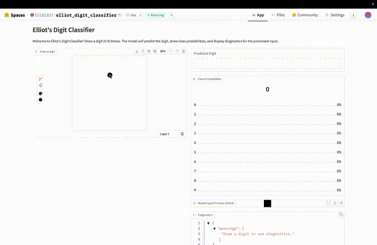
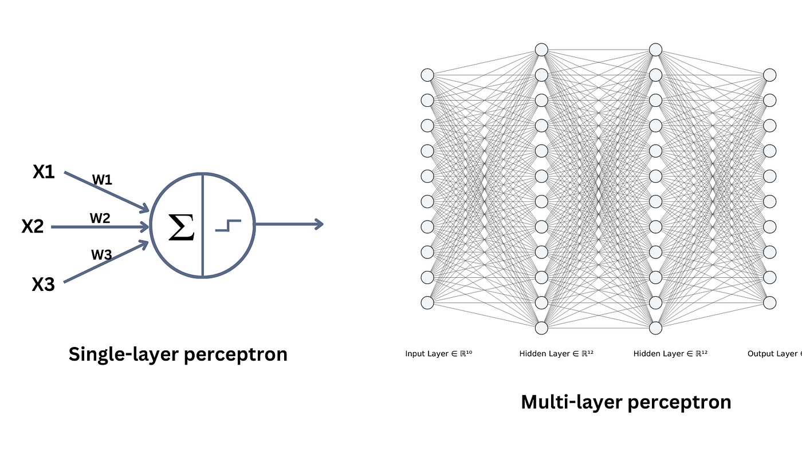
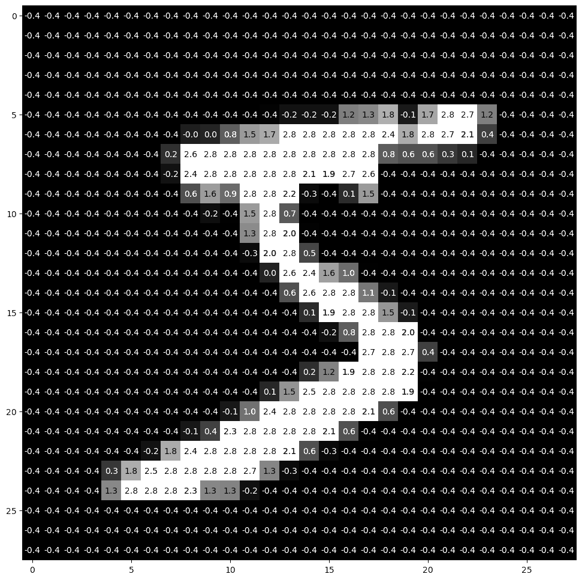
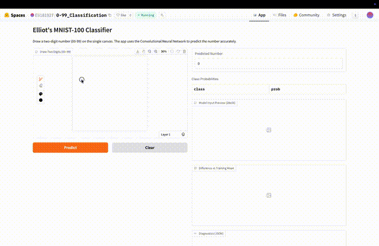
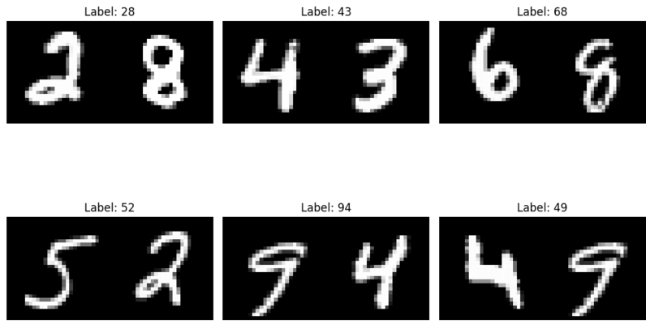
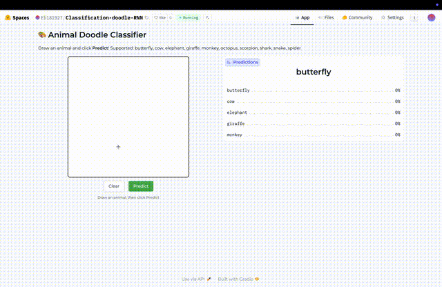
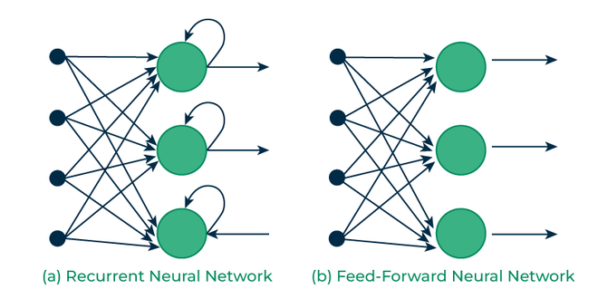
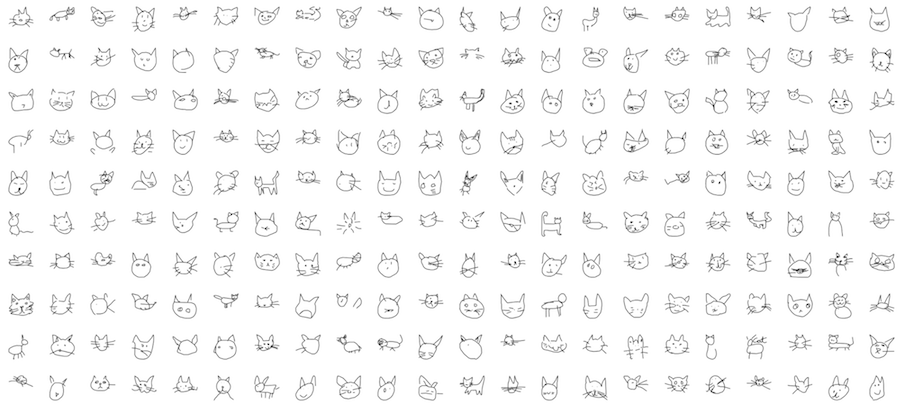
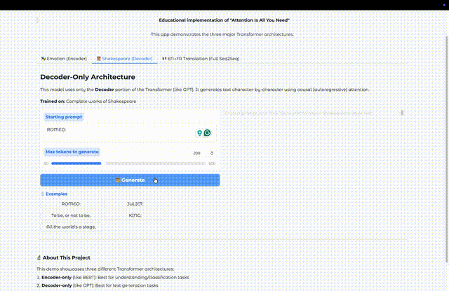
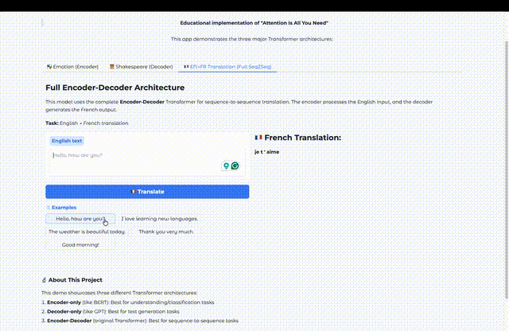

<p align="center">
  <h1 align="center">Neural Networks Fundamentals</h1>
  <p align="center"><em>From neurons to transformers — building every major architecture from scratch</em></p>
</p>

<p align="center">
  
  
  
  
</p>

---

## Overview

| # | Architecture | Task | Accuracy | Demo |
|---|---|---|---|---|
| 1 | **Multi-Layer Perceptron** | MNIST digit classification (0-9) | 97%+ | [Try it](https://huggingface.co/spaces/Eli181927/elliot_digit_classifier/) |
| 2 | **Convolutional Neural Network** | Two-digit classification (0-99) | 97.88% | [Try it](https://huggingface.co/spaces/Eli181927/0-99_Classification) |
| 3 | **Recurrent Neural Network** | Doodle classification (10 animals) | 94.36% | [Try it](https://huggingface.co/spaces/Eli181927/Classification-doodle-RNN) |
| 4 | **Transformers** | Emotion, Shakespeare, EN→FR translation | — | [Try it](https://huggingface.co/spaces/Eli181927/Transformer_Demo) |

Every model is implemented from first principles — no high-level ML wrappers — so you can see exactly how each algorithm works.

---

## Table of Contents

- [1. Multi-Layer Perceptron](#1-multi-layer-perceptron)
- [2. Convolutional Neural Network](#2-convolutional-neural-network)
- [3. Recurrent Neural Network](#3-recurrent-neural-network)
- [4. Transformers](#4-transformers)
- [Project Structure](#project-structure)
- [Getting Started](#getting-started)
- [Data](#data)

---

## 1. Multi-Layer Perceptron



[Try the MLP digit classifier](https://huggingface.co/spaces/Eli181927/elliot_digit_classifier/) · [README](1.MLP/README.md) · [Training code](1.MLP/training.py)

| | |
|---|---|
|  |  |
| Multi-Layer Perceptron | MNIST Dataset |

- **Goal** — Accurately predict hand-drawn digits in production
- **Dataset** — MNIST 28×28 grayscale images (60k train / 10k test)
- **Architecture** — 784 → 256 → 128 → 10 with ReLU, Adam, He init, L2 regularization
- **Result** — 97%+ test accuracy

<details>
<summary>MLP Quickstart</summary>

```bash
cd 1.MLP
python -m venv .venv && source .venv/bin/activate
pip install -r requirements.txt
python setup_data.py            # download MNIST
python training.py              # train → archive/trained_model.npz
python test_model.py            # evaluate
python app.py                   # launch demo
```

</details>

---

## 2. Convolutional Neural Network



[Try the CNN classifier](https://huggingface.co/spaces/Eli181927/0-99_Classification) · [README](2.CNN/README.md) · [Training code](2.CNN/training_torch.py)

| | |
|---|---|
|  |  |
| Convolutional Neural Network | MNIST-100 Dataset |

- **Goal** — Scale digit recognition to two-digit numbers (0-99)
- **Dataset** — Paired-MNIST 28×56 images (concatenated digits, 00-99 labels)
- **Architecture** — Conv(3×3,16) → ReLU → MaxPool → Conv(3×3,32) → ReLU → MaxPool → FC(256) → FC(100)
- **Result** — 97.88% test accuracy (10,000 samples)

<details>
<summary>CNN Quickstart</summary>

```bash
cd 2.CNN
python -m venv .venv && source .venv/bin/activate
pip install -r requirements.txt
python setup_data.py

# Option A: From-scratch NumPy (GPU recommended)
python training-100.py --epochs 20 --batch-size 256

# Option B: PyTorch (fast on CPU)
python training_torch.py --epochs 20 --batch-size 256 --device cpu

python test_model.py            # evaluate
python app.py                   # launch demo
```

</details>

---

## 3. Recurrent Neural Network



[Try the RNN doodle classifier](https://huggingface.co/spaces/Eli181927/Classification-doodle-RNN) · [README](3.RNN/README.md) · [Training code](3.RNN/training-doodle.py)

| | |
|---|---|
|  |  |
| Recurrent Neural Network | Animal Doodle Dataset |

- **Goal** — Classify hand-drawn doodles into 10 animal classes
- **Dataset** — Google Quick, Draw! stroke sequences (dx, dy, pen-lift)
- **Architecture** — 2-layer bidirectional GRU (hidden 192), AdamW, label smoothing, dropout
- **Result** — 94.36% top-1 accuracy (188,779 test samples)

<details>
<summary>RNN Quickstart</summary>

```bash
cd 3.RNN
python -m venv .venv && source .venv/bin/activate
pip install -r requirements.txt
python setup_data.py            # download Quick, Draw! data
python training-doodle.py       # train → archive/rnn_animals_best.pt
python eval_and_plots.py        # evaluate + generate plots
python app.py                   # launch demo
```

</details>

---

## 4. Transformers

<table align="center">
  <tr>
    <td align="center" width="50%">
      
      <br>Emotion Analysis (Encoder)
    </td>
    <td align="center" width="50%">
      
      <br>Shakespeare Generator (Decoder)
    </td>
  </tr>
</table>

<p align="center">
  
  <br>Machine Translation EN→FR (Seq2Seq)
</p>

[Try the Transformer Demo](https://huggingface.co/spaces/Eli181927/Transformer_Demo) · [README](4.Transformers/README.md)

A from-scratch implementation of the Transformer architecture from ["Attention Is All You Need"](https://arxiv.org/abs/1706.03762), split into three progressively complex projects:

| Sub-project | Architecture | Task | Training code |
|---|---|---|---|
| **Encoder** | Encoder-only | 6-class emotion classification + masked language modeling | [sentiment/train.py](4.Transformers/encoder_transformer/sentiment/train.py) |
| **Decoder** | Decoder-only (GPT) | Character-level Shakespeare generation | [training.py](4.Transformers/decoder_transformer/training.py) |
| **Machine Translation** | Full Seq2Seq | English → French translation | [train_mini.py](4.Transformers/machine_translation/train_mini.py) |

<details>
<summary>Transformer Quickstart</summary>

```bash
cd 4.Transformers
pip install -r requirements.txt

# Encoder: Masked Language Model
python encoder_transformer/mlm/train.py

# Decoder: Shakespeare language model
python decoder_transformer/training.py

# Machine Translation: EN→FR
python machine_translation/setup_data.py --dataset wmt14 --out_dir data/en_fr
python machine_translation/train_mini.py --train_csv data/en_fr/train.csv --val_csv data/en_fr/test.csv

# Launch 3-tab Gradio demo
python app.py
```

</details>

---

## Project Structure

```
Neural_Networks_Fundamentals/
├── README.md
├── requirements.txt
├── .gitignore
├── MLP.gif, CNN.gif, Doodle.gif
├── Encoder.gif, Decoder.gif, Machine_Translation.gif
│
├── 1.MLP/                          # Pure-NumPy MLP
│   ├── training.py, app.py, test_model.py, setup_data.py
│   └── assets/
│
├── 2.CNN/                          # NumPy + PyTorch CNN
│   ├── training-100.py, training_torch.py, app.py, test_model.py, setup_data.py
│   └── assets/
│
├── 3.RNN/                          # PyTorch GRU-based RNN
│   ├── training-doodle.py, app.py, eval_and_plots.py, setup_data.py
│   └── assets/
│
└── 4.Transformers/                 # Full Transformer suite
    ├── app.py                      # 3-tab Gradio demo
    ├── optimize_models.py
    ├── encoder_transformer/        # Encoder-only (emotion + MLM)
    ├── decoder_transformer/        # Decoder-only (Shakespeare)
    └── machine_translation/        # Full Seq2Seq (EN→FR)
```

---

## Getting Started

```bash
# Clone the repo
git clone https://github.com/Elliot-Sones/Neural_Networks_Fundamentals.git
cd Neural_Networks_Fundamentals

# Create a virtual environment
python -m venv .venv && source .venv/bin/activate

# Install all dependencies
pip install -r requirements.txt
```

Then navigate into any section folder (`1.MLP/`, `2.CNN/`, `3.RNN/`, `4.Transformers/`) and follow the quickstart in its README.

### Weights & Checkpoints

Model weights (`.pt`, `.npz`) are not tracked in this repo. To run demos locally, either:
- **Train from scratch** using the training scripts in each section, or
- **Download checkpoints** from the corresponding [Hugging Face Spaces](https://huggingface.co/Eli181927)

---

## Data

| Section | Dataset | Source | Generated by |
|---|---|---|---|
| 1.MLP | MNIST (28×28, 0-9) | [CVDF mirror](https://storage.googleapis.com/cvdf-datasets/mnist) | `1.MLP/setup_data.py` |
| 2.CNN | MNIST-100 (28×56, 0-99) | Paired from MNIST | `2.CNN/setup_data.py` |
| 3.RNN | Quick, Draw! (10 animals) | [Google Quick Draw](https://storage.googleapis.com/quickdraw_dataset/full/simplified/) | `3.RNN/setup_data.py` |
| 4.Transformers | Tiny Shakespeare, GoEmotions, WMT14 EN-FR | Various | See [4.Transformers/README.md](4.Transformers/README.md) |

All training data is downloaded on demand by the `setup_data.py` scripts and is excluded from version control via `.gitignore`.
